# Git crash course

## Davide Alberani <da@erlug.linux.it> 2017-2018

 
Crash course to not bang your head against the wall when you have to use Git.

 
 

**git clone https://git.lattuga.net/alberanid/git-crash-course-en.git**

 
 
This work is licensed under the Creative Commons Attribution-ShareAlike 4.0 International License: http://creativecommons.org/licenses/by-sa/4.0/

---

## Who is this for

For beginners who have to work in small teams

-----

## Course layout

### Part 1

Basics to work with local and remote repositories

### Part 2

A workflow for collaborative development

### Part 3

Some more advanced tool

-----

## What we will talk about

* basic, high-level, command line tools. Also known as **porcelain**, they are based on others, lower-level, commands (known as *plumbing*)

* how to manage *branches*

* basics to work with remote repositories

* a workflow to cooperate with other developers

-----

## What we will NOT talk about

* low-level (**plumbing**) commands
* *Github* web GUI (sorry, it's just an hosting service)
* GUIs
* how to admin a remote repository
* flame wars on the merits of different workflows

-----

## What's Git

A dirstributed control version tool.

It's used to keep track of changes to code (or other textual stuff) and to ease the cooperative development. It's worth to remember that it was born to help mostly who had to coordinate other people's code.

 
More details [on Wikipedia](https://en.wikipedia.org/wiki/Git%5F%28software%29).

-----

## What Git is NOT

* it's not Subversion or CVS
* it's not a backup tool
* it's not a [deploy tool](https://grimoire.ca/git/stop-using-git-pull-to-deploy) (or maybe it is, but think carefully about it)

-----

## Some will say

*Git will have no secrets for you, once you'll understand...*

* ...its data model (objects, blobs, trees, commits, refs, tags, ...)
* ...that everything is local
* ...that commits are snapshots, and not deltas from the previous state
* ...some strange quantum theory

 

### Honestly?

That's all true, but its UI is a mess.

---

## Basics: definitions

* **Working directory**: the files and directories you're working on

* **Staging area** (or **Index**): where we store changes that will be included into the next commit

* **Commit**: a snapshot of all files and directories at a given moment

* (do a) **Checkout**: update files in the working directory to a given branch/commit/...

* **HEAD**: the point over which we'll connect the next commit (usually, the current branch)

* **refs**: collettive name to refer to HEAD, branches, tags

-----

## Basics: use git config to setup the environment

    $ git config --global user.name "Davide Alberani"
    $ git config --global user.email da@erlug.linux.it
    $ git config --global color.ui auto

Settings can be stored in these files (in reading order: the latter will overwrite previous settings):
* **/etc/git/config**: global options, valid for every users
* **~/.gitconfig** or **~/.config/git/config**: settings for the current user
* **.git/config** in the current repository: local settings valid only for this repository

 

### Bonus track

* Some examples of gitconfig files are [this one](https://github.com/alberanid/git-config/blob/master/gitconfig) and [this other one](https://gist.github.com/pksunkara/988716)

-----

### Basics: some common settings

Aliases:

    $ git config --global alias.st status
    $ git config --global alias.br branch
    $ git config --global alias.co checkout

Colors:

    $ git config --global color.branch.current "yellow bold"
    $ git config --global color.branch.local "green bold"
    $ git config --global color.branch.remote "cyan bold"
    $ git config --global color.status.added "green bold"

Github user:

    $ git config --global github.username [nome]

---

## Part 1

Where we give what's needed to work locally and remotely

---

## Basics: create a repository

Initialize a repository starting from a directory (empty or not):

    $ git init

Clone an existing remote repository:

    $ git clone https://git.lattuga.net/user/repo.git

-----

## create a repository: what happened?

It created the **.git** directory (the **repository**); if we made a clone, a reference to the "*origin*" remote was added.

 

### Bonus track

* remote repositories are usually created with **--bare** (they have no working directory); nobody works directly on them: developers commit on their own clones and push the changes.

-----

<!-- .slide: class="two-cols" -->

## Basics: status

To know the status of the repository, staging area and working directory (a nice [cheatsheet](https://ndpsoftware.com/git-cheatsheet.html)):

    $ git status [-s]

### File states

* **Untracked**: new files in the working directory, not yet added

* **Unmodified**: files that were not modified since the previous commit

* **Modified**: modified in the working directory, but not yet added to the staging area

* **Staged**: added to the staging area, ready to be committed

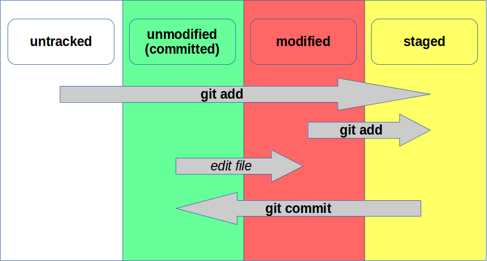

---

## Basics: add and commit

Let's change a file and add it to the staging area:

    $ git add test.txt

Lets commit it:

    $ git commit [-m "commit message"]

Let's see what happened:

    $ git log

-----

## add and commit: what happened?

We added a file to the staging area, and saved a snapshot of our work. If we are in a branch, this branch now points to the new commit (HEAD still point to the branch, so it also points to the new commit).

 

### Bonus track

* guess what **git rm** and **git mv** do
* [commit often](https://sethrobertson.github.io/GitBestPractices/)
* how to write [a nice commit message](https://chris.beams.io/posts/git-commit/)? Issue, short title, long description
* it doesn't save empty directories; if needed, add a *.gitkeep* (just a convention)
* create a *.gitignore* file to exclude some files

-----

## What's a commit?

Commits are snapshots of the system at a given moment, **identified by an hash** (e.g.: *6d7696a8b894c8ef039d6fd2ecdc514a2efe16b5*).

A commit hash is generated by: message, committer, author, dates, tree, parent hash.

 

### Bonus track

* it's possible to shorten the hashes, as long as they stay unique (e.g. *6d769*)
* for more details see [anatomy of a Git commit](https://blog.thoughtram.io/git/2014/11/18/the-anatomy-of-a-git-commit.html) and [Git Internals](https://git-scm.com/book/it/v2/Git-Internals-Git-References)

-----

## Basics: history

    $ git log [--stat] [--patch] [--graph] [--decorate] [--color] [-2]

Shows the commits history from the current point (or from a given refs) down to the very first commit.

You can limit the output to the latest N commits with ***-N***

 

### Bonus track

* see commits that changed a given file: **git log -- file.txt**
* to see information about a single commit you can also use **git show**
* information about who edited the lines of a file: **git blame file.txt**

-----

## Basics: diff

Let's change a file, without adding it to the staging area:

    $ git diff

To see what was added to the staging area (**and reason why it's so useful**):

    $ git diff --staged

-----

## Basics: tag

A tag is a pointer to a commit:

    $ git tag -a v1.0

 

### Bonus track

* there are two types of tags: *lightweight* and *annotated*. The firsts are just pointers, the seconds are objects with an author and can be signed.

---

## Damage control

How to modify the last commit (change commit message or author, or change a file - in this case you first need to modify it in the working directory and then do *git add*):

    $ git commit --amend [--author="Name Surname <user@example.com>"]

A file was added by mistake to the staging area:

    $ git reset HEAD -- file

Revert a file to the last committed (or staged) state:

    $ git checkout -- file

### Bonus track

* using *--amend* the commit ID will change, for this reason you can only use it on the very last commit of a branch
* **git clean -f** to remove all the untracked files

-----

## Damage control: harder

I made a mess in the working directory. Let's bring everything to the last commited state:

    $ git reset --hard HEAD

I want to create a new commit that revert the changes introduced in a given commit:

    $ git revert [-n] <commit>

 

### Bonus track

* more [informantion on reset](https://stackoverflow.com/questions/3528245/whats-the-difference-between-git-reset-mixed-soft-and-hard)
* workflow [to solve problems ](http://justinhileman.info/article/git-pretty/git-pretty.png)
* [some useful commands](http://ohshitgit.com/) to solve mistakes

---

## Branches: what they are and why to use them?

They are moving pointers, moved with each new commit.

They are useful to separate different strands of development and to integrate contributions from others.

-----

## Branches: create

Create a branch:

    $ git branch fix/bug-123

See all branches:

    $ git branch [-a] [-v]

Remove a local branch:

    $ git branch -d [--force] fix/bug-123

-----

## Branches: switch between branches

Let's move to another branch:

    $ git checkout fix/bug-123

Create and move in a single command (only if the branch doesn't exist):

    $ git checkout -b fix/bug-123

 

### Bonus track

* moving, Git tries to keep the changes in the working directory and staging area

-----

## Branches: more information

* **master** is just a default (usually master is considered "stable")

* give [meaningful names](http://www.guyroutledge.co.uk/blog/git-branch-naming-conventions/); use suffixes like *bugfix/*, *fix/*, *improvement/*, *feature/*, *task/*) and issue numbers

* get used to create a new branch (that usually will start from *master*) **each time** you need to fix a bug or develop a new feature

* may be logically divided in *feature* (o *topic*), *release*, *integration* branches and so on

---

## Put the pieces back together: merge

    $ git checkout -b fix/bug-123
    $ # let's edit newfile.txt
    $ git add newfile.txt
    $ git commit

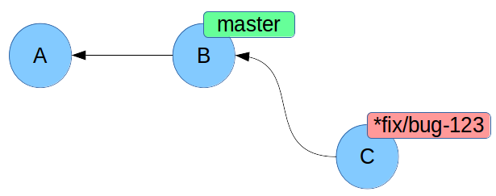

    $ git checkout master
    $ git merge fix/bug-123

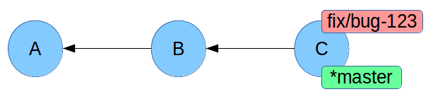

-----

## Merge: what happened?

A **fast-forward**!

master was behind compared to fix/bug-123, and so we simply moved master's pointer. There was no need to create a new commit.

The commit command takes the **--ff-only** and **--no-ff** options decide how to behave regarding the creation of a merge commit.

-----

## Conflicts resolution

    $ git branch fix/bug-123
    $ git checkout fix/bug-123
    $ # let's edit file.txt
    $ git add file.txt
    $ git commit

    $ git checkout master
    $ # let's edit file.txt differently, on the same lines
    $ git add file.txt
    $ git commit

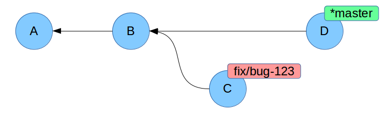

### Bonus track

* which commits are part of the fix/bug-123 and master branches?

-----

## Conflicts resolution

Let's merge:

    $ git merge fix/bug-123
    $ # let's resolve the conflicts
    $ git add file.txt
    $ git commit

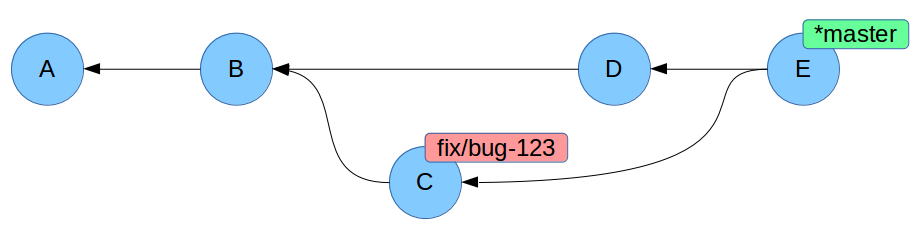

### Bonus track

* what happens to *C* commit, if we delete the fix/bug-123 branch?

-----

## Conflict files

Always look for every **<<<<<<<**, **=======** and **>>>>>>>** markers

 

### Bonus track

* you can use **meld** to solve the conflicts

---

## Working with remote repositories

    $ git remote add origin https://git.lattuga.net/user/repo.git
    $ git remote -v

 

### Bonus track

* **origin** is just a default
* you can checkout a remote branch like **remote/branch** (e.g.: *git checkout origin/fix/bug-123*)

-----

## Fetch & pull

Update the local repository with the new commits of a remote:

    $ git fetch --prune origin

See which commits are different between local and remote:

    $ git log --left-right master...origin/master

Update the remote changes and merge then in the current branch:

    $ git pull origin

 

### Bonus track

* **git pull** is the same as **git fetch ; git merge**

-----

## Local and remote branches

* **local branch**: a branch you only have locally

* **remote branch**: a branch on a remote repository

* **remote tracking branch**: local copy of a remote branch; you can update it with fetch, but can't work directly on it

* **local tracking branch**: a local branch you can work on, tracking another branch (usually a remote tracking branch)

* local tracking of remote branches is done automatically, based on the name of the branch: if in a remote repository the branch *origin/branch-1* exists, the *git checkout branch-1* command will create a local tracking branch

-----

## Push

Add a local branch to the remote repository:

    $ git push --set-upstream origin local-branch-name

Send local changes to a remote branch:

    $ git push [--tags] [origin [master]]

 

### Bonus track

* by default, git push does not send tags, which must be pushed separately with the *--tags* argument
* how to remove a remote branch: **git push --delete origin branch-name**

-----

## Talking about remote history...

A thing to **NEVER** do (unless you know exactly what you will face): change an already-pushed history.

That's because if someone else is working on the same remote branch, the repositories will no longer be coherent.

---

## Part 2

Where we will show a ready-to-use workflow, to work with a remote repository as a team

---

## Which workflow?

Deciding which workflow to follow, you need to answer some questions like:

* who are the developers? Do you accept contributions only from a small group, or from anyone?
* how do you release the software? Do you have multiple versions to support? The new versions are developed starting from which branches?
* who is in charge of integration (merging)? The developers, or a specific person?

-----

<!-- .slide: class="align-left" -->

## Worflows: multiple options

The main worflows are:

* centralized
* feature branch
* gitflow
* forking
* something kept together with rubber bands

Some resources to decide:

* https://www.atlassian.com/git/tutorials/comparing-workflows
* https://guides.github.com/introduction/flow/

---

## Forking workflow

We'll see the **forking workflow**. It's not "the best" (no workflow is), but is the one you will deal with on Github, for example. Some useful definitions:

* there is an "official" repository (that we'll call **upstream**, from the developers' point of view); only core authors can write on it
* **project maintainer** role: the person in charge of merges on the upstream repository
* **developer** role: a person who is developing a fix or new feature
* each developer will have a remote fork of the upstream repository and a local clone of this remote fork to work on

-----

## Forking workflow: maintainer setup

The project maintainer created the remote upstream repository and a local clone.

    $ git clone https://git.lattuga.net/maintainer/repo.git

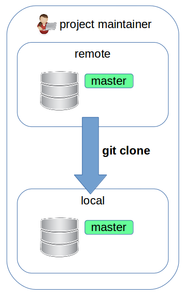

-----

## Forking workflow: developer setup

The developer now will:

* create a remote **fork** of the upstream repository

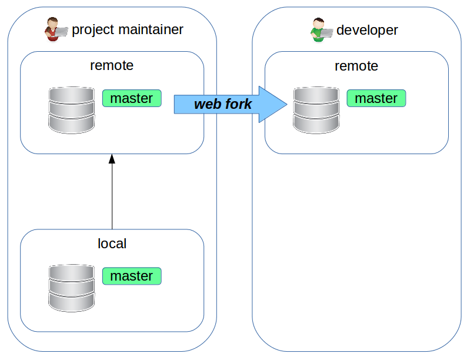

### Bonus track

* a fork is nothing more than a clone (with --mirror) of a repository

-----

## Forking workflow: developer setup

The developer will now crete a local **clone** of the remote repository. It's a good idea to add an "**upstream**" remote that points to the maintainer's repository:

    $ git clone https://git.lattuga.net/developer/repo.git
    $ cd repo
    $ git remote add upstream https://git.lattuga.net/maintainer/repo.git

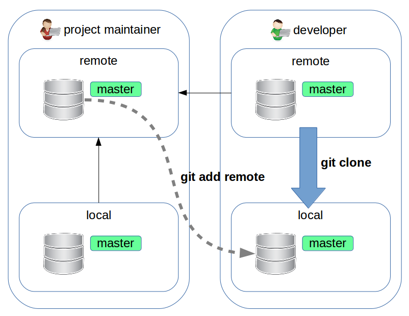

-----

## Forking workflow: let's start with the development

The developer writes fix that will be applied to the master branch of the upstram repository.

First of all, it's a good idea to sync the local master branch with the upstream one, to work on up-to-date code:

    $ git checkout master
    $ git pull upstream master

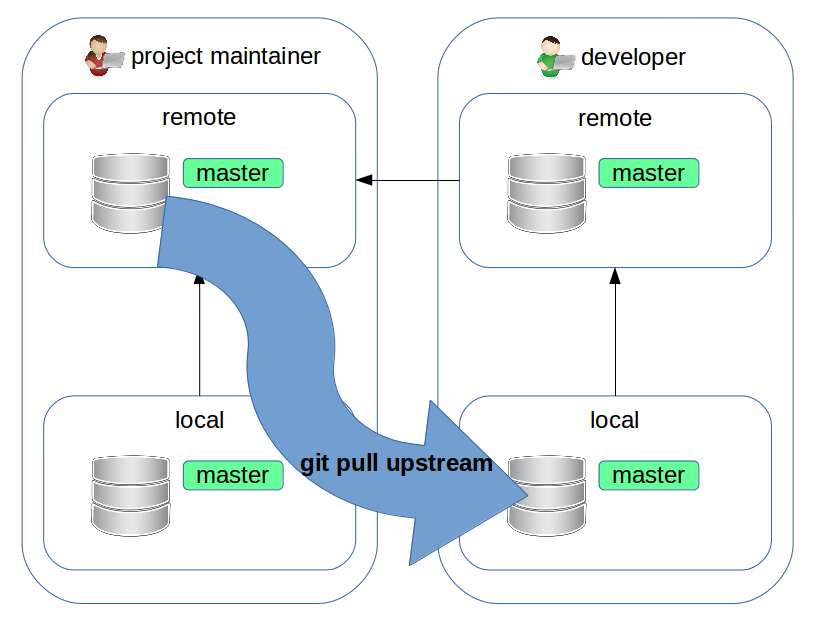

-----

## Forking workflow: new branch

    $ git checkout -b fix/bug-123

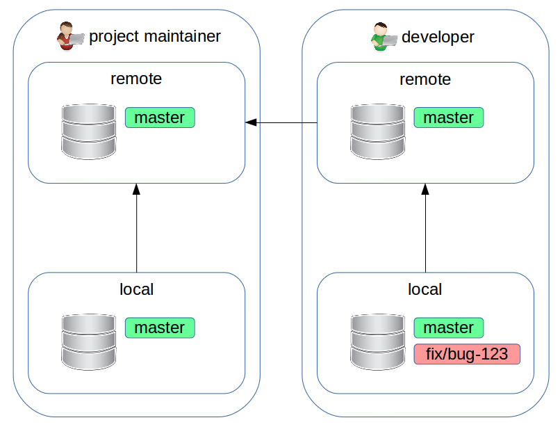

### Bonus track

* **NEVER** work directly on *master*: you would lose the possibility to sync again with *upstream*, in the future

-----

## Forking workflow: do our work

    $ # introduce the fix
    $ git commit
    $ git push --set-upstream origin fix/bug-123

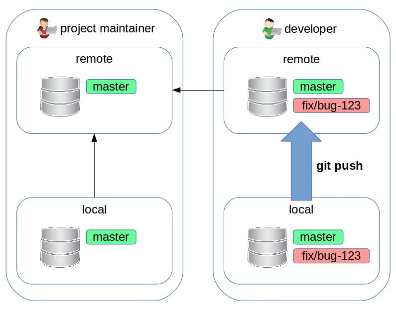

-----

## Forking workflow: pull request

Now the developer goes to the web page of the fork and creates a **pull request**.

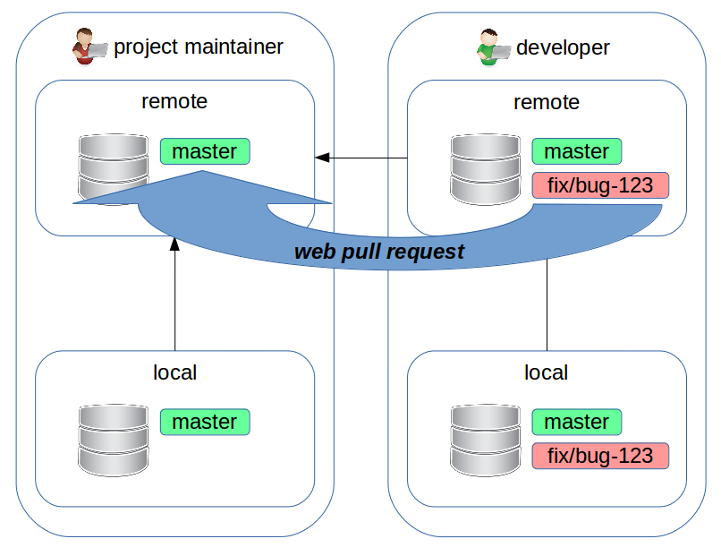

### Bonus track

* it makes sense to do a rebase on *upstream/master* of the feature branch we are working on, before the pull request is done (if you have already pushed, you need to push --force), so that your work will be as close as possible to the current state of upstream/master

-----

## Forking workflow: pull request

"Pull request" is not (exactly) a concept of Git itself. It's something built upon it, to ease the collaboration between developers.

The pull request we created above just says: "I suggest to apply the changes in the *developer:fix/bug-123* branch onto *maintainer:master*"
Now the developer, project maintainer and others can discuss the merit of the changes.

If needed, the deleloper or others can add new commits with just a simple push.

-----

## Forking workflow: merging

Once everyone is satisfied, the project maintainer will merge the code on *maintainer:master*.

**If there are no conflicts**, the merge can be done directly from the web GUI of the upstream repository.

If there are conflicts, the project maintainer will add a remote pointing to the repository of *developer*, fetch *developer:fix/bug-123*, merge it on master and then (after the conflicts are solved) push it on the upstream repository.

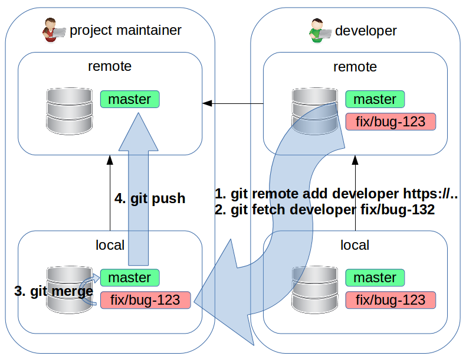

-----

<!-- .slide: class="align-left" -->

## Forking workflow: I lied!

Github and friend will not suggest you to add the developer's repository as a remote, but to directly pull only the topic branch. It makes sense if you receive a lot of pull requests from many developers. Otherwise, if the number of developers is low (small projects, or inside a company) it makes sense to add developers' repositories as remotes.

To show you, Github suggests to:

1. git checkout -b developer/bug-123 master
1. git pull https://github.com/developer/repo.git fix/bug-123
1. git checkout master
1. git merge --no-ff developer/bug-123
1. git push origin master

-----

## Forking workflow: maintainer's setup summary

1. local clone: **git clone https://git.lattuga.net/maintainer/repo.git**

-----

## Forking workflow: developer's setup summary

1. fork on the web GUI
1. local clone of the fork: **git clone https://git.lattuga.net/developer/repo.git**
1. add a remote pointing to the upstream repository: **git remote add upstream https://git.lattuga.net/maintainer/repo.git**

-----

## Forking workflow: developer's work summary

1. update local master from upstream: **git checkout master ; git pull upstream master**
1. create a branch to work on: **git checkout -b fix/bug-123**
1. works a lot: **git commit**
1. optionally, do a rebase: **git rebase upstream/master**
1. sends changes to the remote repository: **git push --set-upstream origin fix/bug-123**
1. create a pull request on the web GUI
1. if needed, the developer updates the pull request with more commits and pushes of fix/bug-123

-----

<!-- .slide: class="align-left" -->

## Forking workflow: maintainer's work summary

1. receive and evaluate a pull request
1. if it can be merged without conflicts, the merge can be done on the web GUI

*Otherwise the maintainer will:*

1. if not already done, add a remote for the developer's repository: **git remote add developer https://git.lattuga.net/developer/repo.git**
1. create a *local tracking branch* to work on: **git fetch developer fix/bug-123**
1. move to master: **git checkout master**
1. merge, resolving the conflicts: **git merge --no-ff fix/bug-123**
1. send the commits to the remote repository: **git push origin master**

---

## Part 3

Where we will see some advanced tools

---

## How to reference commits

Going up of 3 livels, always following the first parent commit (in case of merge):

    $ git show -s HEAD~3

Going up of 1 level, following the second parent commit (in case of merge):

    $ git show -s HEAD^2

### Bonus track

* **detached HEAD**: we moved (checkout) to a commit that is not the head of a branch
* these operators can be chained: HEAD~~^2

-----

## How to reference commits: range

**Double dot range**. Doing a *diff*, shows changes between "master" and "branch"; doing a *log* shows commits that can be reached by "branch" but not from "master":

    $ git diff master..branch

 

**Triple dot range**. Doing a *diff*, shows changes between the forking point of "master" and "branch" and "branch" itself; doing a *log*, shows commits that are reachable from "master" or "branch" but not by both of them:

    $ git log --left-right master...branch

-----

## How to reference commits: range

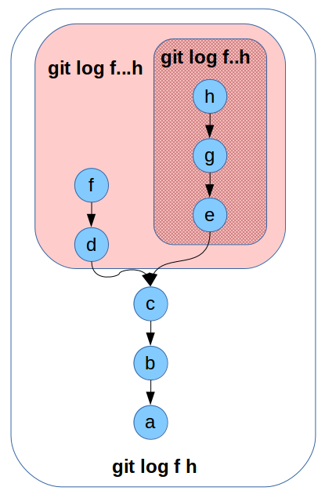
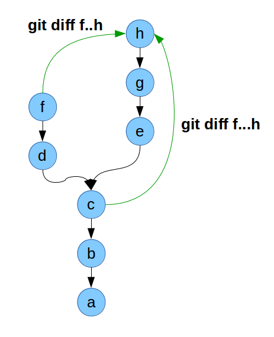

See also [this description](https://stackoverflow.com/questions/7251477/what-are-the-differences-between-double-dot-and-triple-dot-in-git-dif)

---

## Put the pieces back together: cherry-pick

    $ git checkout master
    $ git cherry-pick <commit>
    $ # in case of conflicts: solve them, add the fixed files and then:
    $ git cherry-pick --continue

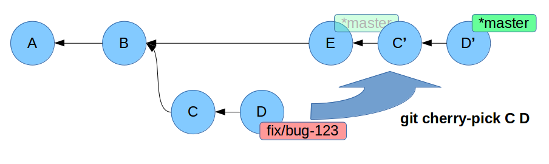

-----

## cherry-pick: what happened?

It takes a commit (usually) from another branch and apply it in the current branch.

New commits are created.

 

### When to use it?

For example to backport a fix on different release branches, or if you noticed that a commit was meant to be done on a different branch.

---

## Put the pieces back together: rebase

Let's recreate the same situation when we used merge (divergent branches) and then:

    $ git checkout fix/bug-123
    $ git rebase master
    $ # in case of conflicts: solve them, add the fixed files and then:
    $ git rebase --continue

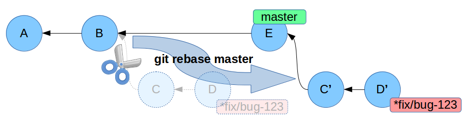

### What happened?

We took all the commits in fix/bug-123 and we have applied them again on master (which advanced, meanwhile).
Now all the commits of fix/bug-123 have changed. If you want, it's now possible to do a fast-forward merge on master.

-----

## Rebase: when to use it?

When you need to move multiple commits and/or you need to do a "clean" merge. It can be done by the developer before a pull request is opened, to ease the job of the maintainer or by the mainter just before the merge, to get a linear history.

 

### When NOT to use it?

A rebase changes the original commits: you should avoid it if the commits were already pushed and other developers are using the remote branch.

---

## Modify the history: rebase interactive

Let's create a new branch and commit 2 or 3 changes.  Then:

    $ git rebase -i master

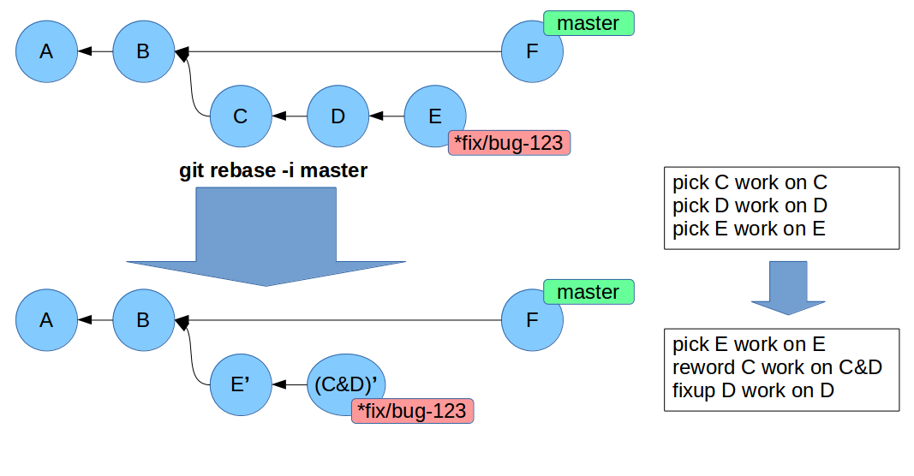

-----

### Rebase interactive: what happened?

We joined, removed or changed the order of the commits.

It's especially useful when we have finished the work on a branch, and we want to clear the history joining multiple commits into a single one.

 

### Bonus track

* the nuclear option: **filter-branch** to create scripts that rewrite the history

---

## Partial work: commit only some lines of a file

Let's edit a file in multiple lines, and then add it to the staging area with *--patch*:

    $ git add --patch

 

### When to use it?

For example when you don't want to include in a commit a debug line, but you still want to keep it in the working directory for future use.

-----

## Create and apply a patch

It's possible to create a patch with this command:

    $ git format-patch [refs]

and then apply it with:

    $ git apply patch-file.diff

-----

## Putting some work aside: stash

Store work currently present in the working directory without committing, and show the stashed changes:

    $ git stash
    $ git stash list

Apply again the shashed changes, and remove a stash (**stash pop** will join the two commands):

    $ git stash apply stash@{0}
    $ git stash drop stash@{0}

### When to use it?

When we want to move to another branch, but we are still not ready to commit the (conflicting) changes present in the working directory.

-----

## History of the changes: reflog

The log history only shows commits included in a branch.

To see ALL the times HEAD changed position:

    $ git reflog [@{2 weeks ago}]

 

### When to use it?

* sometimes it's useful to see how we moved between branches
* very useful to recover **broken commits** that are no longer referenced by any branch (but don't forget that they will be garbage collected, at some point)

---

## Misc stuff

* handle big files: https://git-lfs.github.com/
* another option to handle big files: https://git-annex.branchable.com/
* manage the /etc directory: etckeeper
* manage multiple repositories: https://source.android.com/source/using-repo
* git repository manager: https://about.gitlab.com/
* another git repository manager: https://gogs.io/

-----

## What's missing

* [git submodule](https://git-scm.com/docs/git-submodule): manage other repositories as sub-modules
* [git subtree](https://developer.atlassian.com/blog/2015/05/the-power-of-git-subtree/): insert a repository into a subdirectory
* [repo](https://source.android.com/setup/build/downloading): manage multiple Git repositories
* [git bisect](https://git-scm.com/docs/git-bisect): look for the commit that introduced a bug
* [git gui](https://git-scm.com/docs/git-gui) and [gitk](https://git-scm.com/docs/gitk): GUI to visualize commits and repositories
* [tig](https://jonas.github.io/tig/): textual interface
* [Gitgraph.js](http://gitgraphjs.com/): create graphs from commits and branches

---

<!-- .slide: class="align-left" -->

## Various resources

* Italian translation of these slides: https://git.lattuga.net/alberanid/git-crash-course
* Pro Git: https://git-scm.com/book/en/
* Reference: https://git-scm.com/docs
* Learn Git Branching: http://learngitbranching.js.org/
* Git ready: http://gitready.com/
* Git Cookbook: https://git.seveas.net/
* tutorial di Atlassian: https://www.atlassian.com/git/tutorials
* A visual Git reference: https://marklodato.github.io/visual-git-guide/index-en.html

### Utilities

* bash prompt: https://github.com/magicmonty/bash-git-prompt
* Meld: http://meldmerge.org/

---

## The end

 

**git clone https://git.lattuga.net/alberanid/git-crash-course-en.git**

 

### Davide Alberani <da@erlug.linux.it>

 
This work is licensed under the Creative Commons Attribution-ShareAlike 4.0 International License: http://creativecommons.org/licenses/by-sa/4.0/
