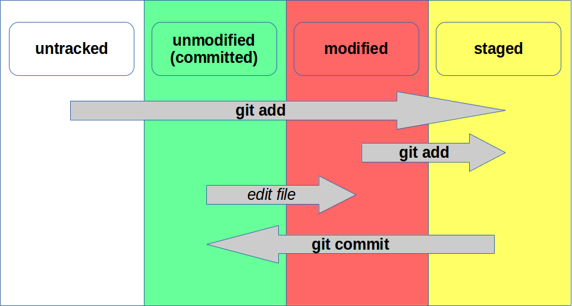
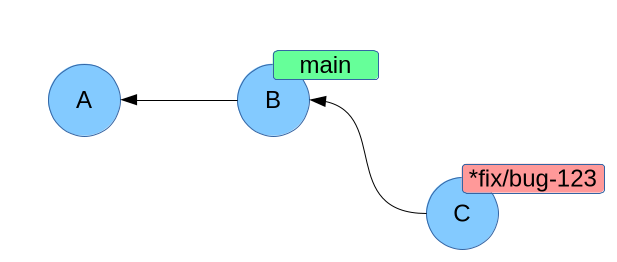
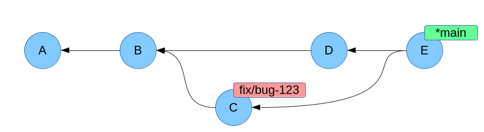
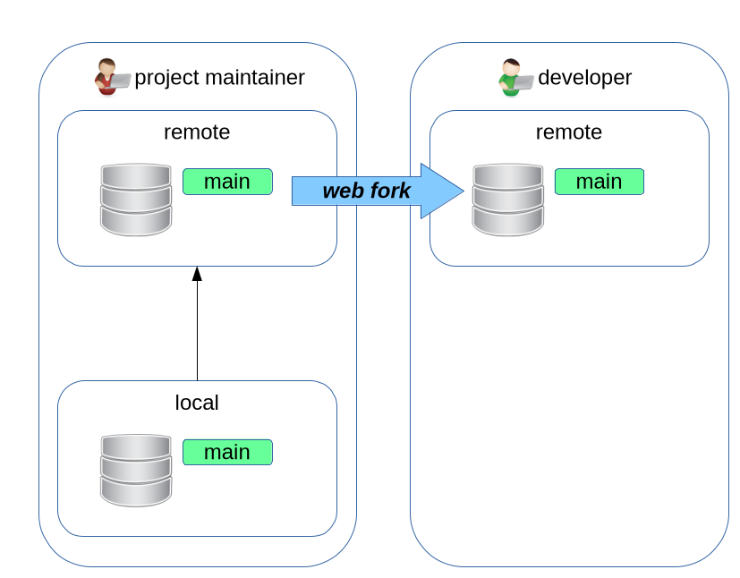
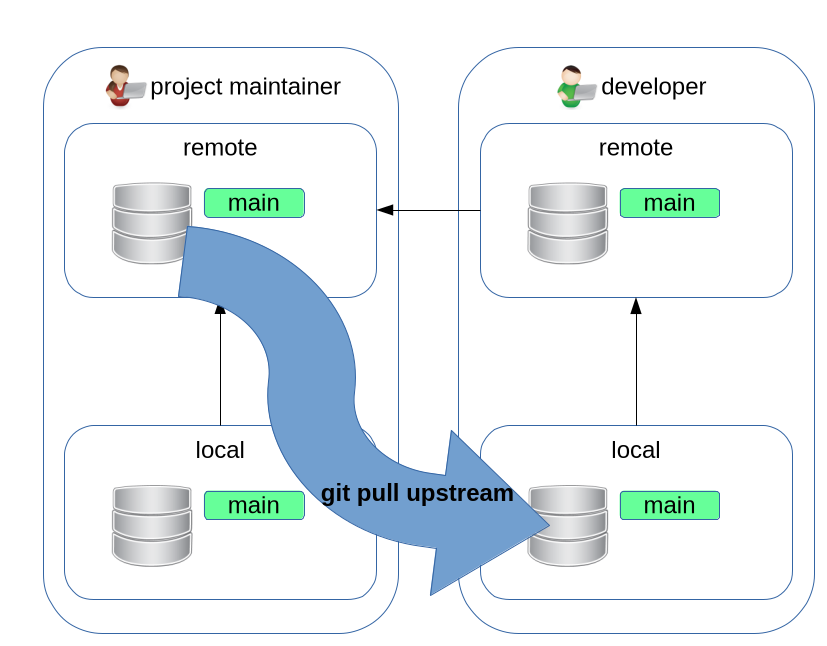
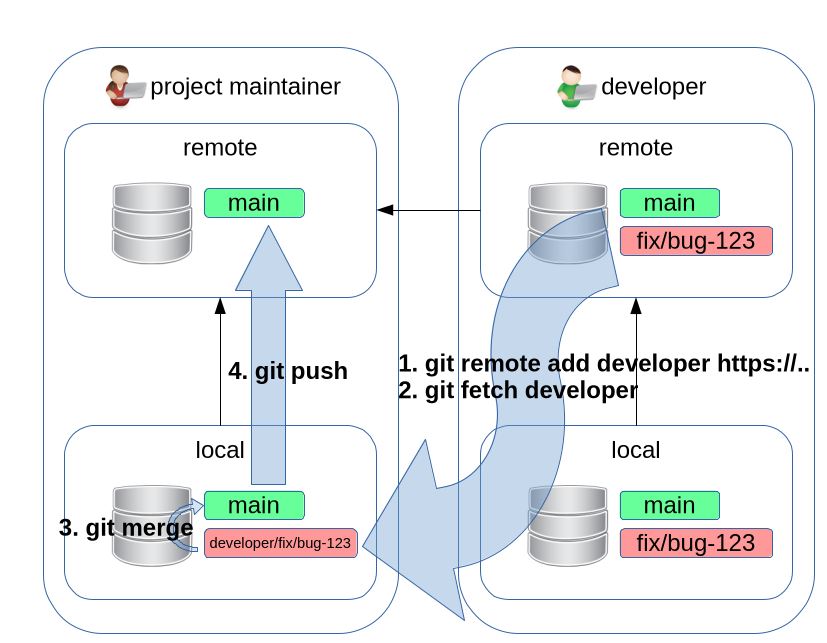
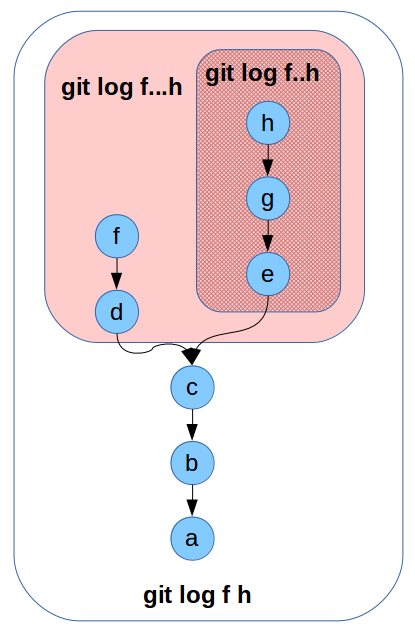
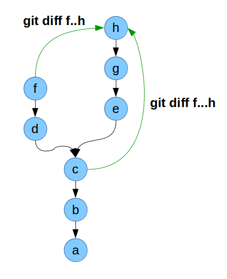
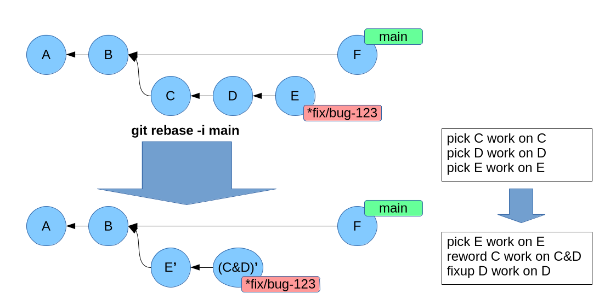

# Git crash course

## Davide Alberani <da@mimante.net> 2017-2026

 
A crash course for using Git without banging your head against the wall.

 
 

**git clone https://git.lattuga.net/alberanid/git-crash-course-en.git**

 
 
This work is licensed under the Creative Commons Attribution-ShareAlike 4.0 International License: http://creativecommons.org/licenses/by-sa/4.0/

---

## Who is this for

For beginners who work in small teams.

-----

## Course layout

### Part 1

The basics of working with local and remote repositories

### Part 2

A workflow for collaborative development

### Part 3

Some more advanced tools

-----

## What we will talk about

* basic, high-level command-line tools. Also known as **porcelain**, they are built on lower-level commands known as *plumbing*

* how to manage *branches*

* the basics of working with remote repositories

* a workflow to cooperate with other developers

-----

## What we will NOT talk about

* low-level (**plumbing**) commands
* the *GitHub* web interface (sorry, it is only a hosting service)
* GUIs
* how to administer a remote repository
* flame wars on the merits of different workflows

-----

## What's Git

A distributed version-control system.

It tracks changes to code and other text files, and supports collaborative development. It was created mainly to help people coordinate other people's code.

 
More details <a href="https://en.wikipedia.org/wiki/Git_(software)">on Wikipedia</a>.

-----

## What Git is NOT

* it's not Subversion or CVS
* it's not a backup tool
* it's not a [deploy tool](https://grimoire.ca/git/stop-using-git-pull-to-deploy) (or maybe it is, but think carefully about it)

-----

## Some will say

*Git will hold no secrets for you once you understand...*

* ...its data model (objects, blobs, trees, commits, refs, tags, ...)
* ...that almost all operations are local (fetch, pull and push communicate with other repositories)
* ...that commits are snapshots, not deltas from the previous state
* ...some strange quantum theory

 

### Honestly?

That's all true, but its UI is a mess.

---

## Basics: definitions

* **Working directory**: the files and directories you're working on

* **Staging area** (or **Index**): where we store changes that will be included into the next commit

* **Commit**: a snapshot of tracked files, with metadata and references to parent commits

* (do a) **Checkout**: update files in the working directory to a given branch/commit/...

* **HEAD**: a reference to the current position in history; normally it points to the current branch, which points to a commit

* **refs**: named references, such as branches and tags; HEAD is a special reference

-----

## Basics: use git config to set up the environment

    $ git config --global user.name "Davide Alberani"
    $ git config --global user.email da@mimante.net
    $ git config --global color.ui auto

Name and email identify the commit author: they are not login credentials. Use your own details.

The main configuration files, in increasing order of precedence:
* **/etc/gitconfig** (the path depends on the installation): system settings for all users
* **~/.config/git/config**, then **~/.gitconfig**: settings for the current user; Git reads both if both exist
* **.git/config** in the current repository: local settings valid only for this repository

 

### Bonus track

* Some examples of gitconfig files are [this one](https://github.com/alberanid/git-config/blob/master/gitconfig) and [this other one](https://gist.github.com/pksunkara/988716)

-----

### Basics: some common settings

Aliases:

    $ git config --global alias.st status
    $ git config --global alias.br branch
    $ git config --global alias.co checkout

Colors:

    $ git config --global color.branch.current "yellow bold"
    $ git config --global color.branch.local "green bold"
    $ git config --global color.branch.remote "cyan bold"
    $ git config --global color.status.added "green bold"

Check values and their source files:

    $ git config --list --show-origin

---

## Part 1

What you need to work locally and with remote repositories

---

## Basics: create a repository

Initialize a repository starting from a directory (empty or not):

    $ git init -b main

These examples use **main** as the primary branch; older repositories may use **master**. The **-b** option requires Git 2.28 or later.

Clone an existing remote repository:

    $ git clone https://git.lattuga.net/user/repo.git
    $ cd repo

-----

## Create a repository: what happened?

It creates the **.git** directory (the **repository**). If we cloned a repository, Git also added a reference to the **origin** remote.

 

### Bonus track

* remote repositories are usually created with **--bare** (they have no working directory); they receive pushes and provide data for fetches. Nobody works directly in them: developers commit in their own clones and push the changes.

-----

<!-- .slide: class="two-cols" -->

## Basics: status

To know the status of the repository, staging area and working directory (a nice [cheatsheet](https://ndpsoftware.com/git-cheatsheet.html)):

    $ git status [-s]

In the examples, **$** is the prompt: do not type it. **[Square brackets]** indicate optional parts; replace **`<placeholders>`** with actual values.

### File states

* **Untracked**: new files in the working directory, not yet added

* **Unmodified**: files that were not modified since the previous commit

* **Modified**: modified in the working directory, but not yet added to the staging area

* **Staged**: added to the staging area, ready to be committed

A file can have both staged and unstaged changes.

---

## Basics: add and commit

Let's change a file and add it to the staging area:

    $ git add test.txt

**git add** stages the current contents of the file: if you edit it again, repeat add to include the new changes.

Create the commit:

    $ git commit [-m "commit message"]

The commit saves the staging area locally. Without **-m**, Git opens an editor for the message.

Let's see what happened:

    $ git log

-----

## Add and commit: what happened?

We added a file to the staging area and saved a snapshot of our work. If we are on a branch, that branch now points to the new commit. HEAD still points to the branch, so it also points to the new commit.

 

### Bonus track

* guess what **git rm** and **git mv** do
* [commit often](https://sethrobertson.github.io/GitBestPractices/)
* how to write [a good commit message](https://chris.beams.io/posts/git-commit/): issue, short title, long description
* Git does not save empty directories; if needed, add a *.gitkeep* file (a convention only)
* create a **.gitignore** file to exclude untracked files: it does not stop tracking files already tracked

-----

## What's a commit?

Commits are snapshots of the tracked files in the staging area at a given moment, **identified by a hash** (e.g.: *6d7696a8b894c8ef039d6fd2ecdc514a2efe16b5*).

The hash depends on the commit contents: message, author, committer, dates, file tree and parent hashes (none for the initial commit, more than one for a merge).

 

### Bonus track

* hashes can be shortened as long as they remain unique (e.g. *6d769*)
* for more details, see [anatomy of a Git commit](https://blog.thoughtram.io/git/2014/11/18/the-anatomy-of-a-git-commit.html) and [Git Internals](https://git-scm.com/book/it/v2/Git-Internals-Git-References)

-----

## Basics: history

    $ git log [--stat] [--patch] [--graph] [--decorate] [--color] [-2]

Shows commits reachable from HEAD (or the specified references), following their parents. **--all** includes all branches and other references.

You can limit the output to the latest N commits with **-N**.

 

### Bonus track

* see commits that changed a given file: **git log -- file.txt**
* see information about a single commit: **git show**
* see who edited the lines of a file: **git blame file.txt**

-----

## Basics: diff

Compare the working directory with the staging area (excluding untracked files):

    $ git diff

Compare the staging area with the last commit (**what will go into the next commit**):

    $ git diff --staged

-----

## Basics: tag

A tag is a pointer to a commit:

    $ git tag -a v1.0

 

### Bonus track

* there are two types of tags: *lightweight* and *annotated*. The former are just pointers; the latter are objects with a tagger, date and message, and can be signed. Unlike branches, tags do not advance with new commits.

---

## Damage control

Modify the last commit by changing its message or author, or by first changing a file in the working directory and then running *git add*:

    $ git commit --amend [--author="Name Surname <user@example.com>"]

Remove a file from the staging area, keeping its changes in the working directory:

    $ git reset HEAD -- file

Overwrite a working directory file with the version in the staging area (**discards unstaged changes**):

    $ git checkout -- file

### Bonus track

* **--amend** replaces the last commit with a new one: avoid it on commits already shared
* **git clean -n** previews untracked files that **git clean -f** would permanently delete; without **-d**, untracked directories are kept, and ignored files are excluded

-----

## Damage control: harder

I made a mess in the working directory. Let's return everything to the last committed state:

    $ git reset --hard HEAD

**Discards uncommitted changes to tracked files**, including staged changes. It may delete untracked files that obstruct the reset; it is not a general cleanup of untracked files.

I want to create a new commit that reverts the changes introduced by a given commit:

    $ git revert [-n] <commit>

With **-n**, it prepares the reversal without creating a commit. For conflicts: resolve them, run **git add**, then **git revert --continue**; to cancel: **git revert --abort**.

 

### Bonus track

* more [information about reset](https://stackoverflow.com/questions/3528245/whats-the-difference-between-git-reset-mixed-soft-and-hard)
* a [workflow for solving problems](http://justinhileman.info/article/git-pretty/git-pretty.png)
* [some useful commands](http://ohshitgit.com/) to solve mistakes

---

## Branches: what they are and why to use them?

They are movable pointers to commits: each new commit advances the current branch.

They are useful to separate different strands of development and to integrate contributions from others.

-----

## Branches: create

Create a branch:

    $ git branch fix/bug-123

List local branches (**-a** also includes remote tracking references):

    $ git branch [-a] [-v]

Remove a local branch:

    $ git branch -d fix/bug-123

Switch to another branch first. **-d** checks that the work is merged into the configured upstream (or HEAD if none is configured); **-D** forces deletion and may lose the reference to unmerged work.

-----

## Branches: switch between branches

Let's move to another branch:

    $ git checkout fix/bug-123

Create and move in a single command (only if the branch doesn't exist):

    $ git checkout -b fix/bug-123

 

### Bonus track

* when switching branches, Git tries to keep the changes in the working directory and staging area

-----

## Branches: more information

* **main** and **master** are conventional names: the primary branch and its stability depend on the project

* give [meaningful names](http://www.guyroutledge.co.uk/blog/git-branch-naming-conventions/); use prefixes like *bugfix/*, *fix/*, *improvement/*, *feature/*, *task/* and issue numbers

* get used to creating a new branch (which will usually start from *main*) **each time** you need to fix a bug or develop a new feature

* branches can be logically divided into *feature* (or *topic*), *release*, and *integration* branches, and so on

---

## Put the pieces back together: merge

    $ git checkout -b fix/bug-123
    $ # let's edit newfile.txt
    $ git add newfile.txt
    $ git commit

    $ git checkout main
    $ git merge fix/bug-123

-----

## Merge: what happened?

A **fast-forward**!

main was behind compared to fix/bug-123, and so we simply moved main's pointer. There was no need to create a new commit.

**git merge** offers **--ff-only** (refuses a merge if a merge commit is needed) and **--no-ff** (creates a merge commit even when a fast-forward is possible).

-----

## Conflict resolution

    $ git branch fix/bug-123
    $ git checkout fix/bug-123
    $ # let's edit file.txt
    $ git add file.txt
    $ git commit

    $ git checkout main
    $ # let's edit file.txt differently, on the same lines
    $ git add file.txt
    $ git commit

### Bonus track

* which commits are part of the fix/bug-123 and main branches?

-----

## Conflict resolution

Let's merge:

    $ git merge fix/bug-123
    $ # let's resolve the conflicts
    $ git add file.txt
    $ git commit

### Bonus track

* what happens to commit *C* if we delete the fix/bug-123 branch?

-----

## Conflict files

Use **git status** to list conflicts. For content conflicts, choose the correct result and remove the **<<<<<<<**, **=======**, **>>>>>>>** markers; then run **git add** and **git commit**.

Not all conflicts have markers (for example, deleted or binary files). To cancel the merge: **git merge --abort**. Start with a clean working directory and staging area.

 

### Bonus track

* you can use **Meld** to resolve conflicts

---

## Working with remote repositories

    $ git remote add origin https://git.lattuga.net/user/repo.git
    $ git remote -v

 

### Bonus track

* **origin** is the conventional name assigned by clone; if it already exists, do not repeat **git remote add origin**
* after fetching, **git checkout --track origin/fix/bug-123** creates a local branch tracking the remote branch; **git checkout origin/fix/bug-123** instead enters *detached HEAD*

-----

## Fetch & pull

Download data and update local remote tracking references, without changing the current branch or working files:

    $ git fetch --prune origin

See which commits differ between local main and remote main:

    $ git log --left-right main...origin/main

Download updates and integrate origin/main into the current branch (here we assume we are on main):

    $ git pull --no-rebase origin main

 

### Bonus track

* **git pull** fetches and then integrates: **--no-rebase** uses merge, **--rebase** uses rebase, **--ff-only** accepts only fast-forwards; without options, behavior also depends on configuration
* **--prune** removes local remote tracking references to branches deleted on the server, not your local branches

-----

## Local and remote branches

* **local branch**: a local reference you work on, which may have a counterpart on a remote

* **remote branch**: a branch on a remote repository

* **remote-tracking branch**: a local copy of a remote branch; you can update it with fetch, but cannot work directly on it

* **local tracking branch**: a local branch you can work on that tracks another branch (usually a remote-tracking branch)

* if *branch-1* does not exist locally and only one remote has that branch name, **git checkout branch-1** normally creates a local branch with upstream **origin/branch-1**. Explicit form: **git checkout --track origin/branch-1**

-----

## Push

Add a local branch to the remote repository:

    $ git push --set-upstream origin local-branch-name

Send local changes to a remote branch:

    $ git push [--tags] [origin [main]]

 

### Bonus track

* by default, **git push** does not send tags; push them separately with the **--tags** option
* remove a remote branch with: **git push --delete origin branch-name**

-----

## Talking about remote history...

A thing to **NEVER** do, unless you know exactly what you are facing: change history that has already been pushed.

If someone else is working on the same remote branch, rewriting its history will leave their repository out of sync.

---

## Part 2

A ready-to-use workflow for working as a team with a remote repository

---

## Which workflow?

Deciding which workflow to follow, you need to answer some questions like:

* who are the developers? Do you accept contributions only from a small group, or from anyone?
* how do you release the software? Do you have multiple versions to support? The new versions are developed starting from which branches?
* who is in charge of integration (merging)? The developers, or a specific person?

-----

<!-- .slide: class="align-left" -->

## Workflows: multiple options

The main workflows are:

* centralized
* feature branch
* gitflow
* forking
* something held together with rubber bands

Some resources to decide:

* https://www.atlassian.com/git/tutorials/comparing-workflows
* https://guides.github.com/introduction/flow/

---

## Forking workflow

We'll see the **forking workflow**. It's not inherently the best, but it is common when contributing to projects on platforms such as GitHub. Some useful definitions:

* there is an "official" repository (that we'll call **upstream**, from the developers' point of view); only core authors can write on it
* **project maintainer** role: the person in charge of merges on the upstream repository
* **developer** role: a person who is developing a fix or new feature
* each developer will have a remote fork of the upstream repository and a local clone of this remote fork to work on

-----

## Forking workflow: maintainer setup

The project maintainer creates the remote upstream repository and a local clone.

    $ git clone https://git.lattuga.net/maintainer/repo.git

-----

## Forking workflow: developer setup

The developer now:

* create a remote **fork** of the upstream repository

### Bonus track

* a fork is a repository copy on a hosting service, linked to the original project by the platform; it is not a Git command and does not necessarily correspond to **clone --mirror**

-----

## Forking workflow: developer setup

The developer now creates a local **clone** of the remote repository. It is a good idea to add an **upstream** remote that points to the maintainer's repository:

    $ git clone https://git.lattuga.net/developer/repo.git
    $ cd repo
    $ git remote add upstream https://git.lattuga.net/maintainer/repo.git

-----

## Forking workflow: let's start with the development

The developer writes a fix to be applied to the main branch of the upstream repository.

First, sync the local main branch with upstream to work on up-to-date code:

    $ git checkout main
    $ git pull --ff-only upstream main

-----

## Forking workflow: new branch

    $ git checkout -b fix/bug-123

### Bonus track

* in this workflow, keep *main* free of your own commits so updates from *upstream* remain fast-forwards. If the branches diverge, **--ff-only** stops and they need to be reconciled

-----

## Forking workflow: do the work

    $ # introduce the fix
    $ git add file.txt
    $ git commit
    $ git push --set-upstream origin fix/bug-123

-----

## Forking workflow: pull request

The developer then goes to the fork's web page and creates a **pull request**.

### Bonus track

* if the project requires it, update **upstream/main** with **git fetch upstream**, then rebase the feature branch. If already published, coordinate with anyone using it: you will need **git push --force-with-lease**, which refuses the update if the remote does not match the expected value

-----

## Forking workflow: pull request

"Pull request" is not, strictly speaking, a Git concept. It is built on Git to make collaboration easier.

The pull request above says: "I suggest applying the changes in the *developer:fix/bug-123* branch to *maintainer:main*."
The developer, project maintainer, and others can then discuss the changes.

If needed, the developer or other authorized users can add new commits with another push.

-----

## Forking workflow: merging

Once everyone is satisfied, the project maintainer merges the code into *maintainer:main*.

**If there are no conflicts**, the merge can be done directly from the web GUI of the upstream repository.

If there are conflicts, the project maintainer can ask the developer to resolve them on their branch, or add a remote for the developer's repository, fetch *developer:fix/bug-123*, merge it into main, resolve the conflicts, and push to the upstream repository.

-----

<!-- .slide: class="align-left" -->

## Forking workflow: without adding a remote

You can integrate a topic branch directly from its URL. This is useful for occasional contributions; for recurring collaboration, adding a remote may be convenient.

For example, with GitHub:

1. git checkout -b developer/bug-123 main
1. git pull --no-rebase https://github.com/developer/repo.git fix/bug-123
1. resolve any conflicts, then run **git add file.txt** and **git commit**
1. git checkout main
1. git merge --no-ff developer/bug-123
1. git push origin main

-----

## Forking workflow: maintainer's setup summary

1. local clone: **git clone https://git.lattuga.net/maintainer/repo.git**

-----

## Forking workflow: developer's setup summary

1. create a fork in the web interface
1. local clone of the fork: **git clone https://git.lattuga.net/developer/repo.git**
1. enter the clone: **cd repo**
1. add a remote pointing to the upstream repository: **git remote add upstream https://git.lattuga.net/maintainer/repo.git**

-----

## Forking workflow: developer's work summary

1. update local main from upstream: **git checkout main ; git pull --ff-only upstream main**
1. create a branch to work on: **git checkout -b fix/bug-123**
1. edit files, then run **git add file.txt** and **git commit**
1. optionally, update and rebase: **git fetch upstream**, then **git rebase upstream/main**
1. send changes to the remote repository: **git push --set-upstream origin fix/bug-123**
1. create a pull request in the web interface
1. if needed, update the pull request with more commits pushed to fix/bug-123

-----

<!-- .slide: class="align-left" -->

## Forking workflow: maintainer's work summary

1. receive and evaluate a pull request
1. if it can be merged without conflicts, merge it in the web interface

*Otherwise the maintainer will:*

1. if not already done, add a remote for the developer's repository: **git remote add developer https://git.lattuga.net/developer/repo.git**
1. download the developer's branches: **git fetch developer**
1. switch to main: **git checkout main**
1. start the merge: **git merge --no-ff developer/fix/bug-123**
1. if there are conflicts, resolve them, then run **git add file.txt** and **git commit**
1. send the commits to the remote repository: **git push origin main**

---

## Part 3

Some advanced tools

---

## How to reference commits

Go up three levels, always following the first parent commit (in case of a merge):

    $ git show -s HEAD~3

Go up one level, following the second parent commit (in case of a merge):

    $ git show -s HEAD^2

### Bonus track

* **detached HEAD**: HEAD points directly to a commit instead of a branch; to keep new commits, create a branch with **git checkout -b name**
* these operators can be chained: HEAD~~^2

-----

## How to reference commits: range

**Double-dot range**. With *diff*, it shows changes between "main" and "branch"; with *log*, it shows commits reachable from "branch" but not from "main":

    $ git diff main..branch

 

**Triple-dot range**. With *diff*, it shows changes between the branch point of "main" and "branch" and "branch" itself; with *log*, it shows commits reachable from either "main" or "branch", but not both:

    $ git log --left-right main...branch

-----

## How to reference commits: range

See also [this description](https://stackoverflow.com/questions/7251477/what-are-the-differences-between-double-dot-and-triple-dot-in-git-dif)

---

## Put the pieces back together: cherry-pick

    $ git checkout main
    $ git cherry-pick <commit>
    $ # only if there are conflicts: resolve them in the files
    $ git add file.txt
    $ git cherry-pick --continue

To cancel the operation in progress: **git cherry-pick --abort**.

-----

## Cherry-pick: what happened?

It takes a commit, usually from another branch, and applies it to the current branch.

New commits are created.

 

### When to use it?

For example, to backport a fix to different release branches, or when you notice that a commit belongs on another branch.

---

## Put the pieces back together: rebase

Let's recreate the situation from the merge example, with divergent branches:

    $ git checkout fix/bug-123
    $ git rebase main
    $ # only if there are conflicts: resolve them in the files
    $ git add file.txt
    $ git rebase --continue

Repeat if other commits produce conflicts. To cancel: **git rebase --abort**.

### What happened?

In this example, the commits unique to fix/bug-123 were reapplied starting from main and have new hashes. The main branch has not moved: after switching back to main, we can now integrate them with **git merge --ff-only fix/bug-123**.

-----

## Rebase: when to use it?

Use it when you need to move multiple commits or want a clean merge. A developer can rebase before opening a pull request to make the maintainer's work easier, or the maintainer can rebase just before merging to produce a linear history.

 

### When NOT to use it?

A rebase changes the original commits: you should avoid it if the commits were already pushed and other developers are using the remote branch.

---

## Modify the history: rebase interactive

Let's create a new branch and commit 2 or 3 changes.  Then:

    $ git rebase -i main

-----

### Rebase interactive: what happened?

We joined, removed or changed the order of the commits.

It's especially useful when we have finished the work on a branch, and we want to clear the history joining multiple commits into a single one.

 

### Bonus track

* for extensive rewrites, the Git documentation discourages **filter-branch** and points to **git-filter-repo** (an external tool)

---

## Partial work: commit only some lines of a file

Let's edit multiple lines in a file, then add selected changes to the staging area with *--patch*:

    $ git add --patch

 

### When to use it?

For example, when you do not want to include a debug line in a commit but still want to keep it in the working directory for later use.

-----

## Create and apply a patch

Export the latest commit as a patch, including its author and message:

    $ git format-patch -1 HEAD --stdout > change.patch

Apply it, creating a commit with the original author and message:

    $ git am change.patch

For unstaged changes only: **git diff > change.diff**, then **git apply change.diff**. The latter changes files without creating commits.

-----

## Putting some work aside: stash

Set aside changes to tracked files, including staged changes, and list stashes. To include untracked files, use **git stash -u** (ignored files remain excluded):

    $ git stash
    $ git stash list

Reapply a stash and, after checking the result, delete it (**stash pop** does both, but keeps the stash if there are conflicts):

    $ git stash apply stash@{0}
    $ git stash drop stash@{0}

### When to use it?

When you want to switch branches but are not ready to commit the changes in the working directory.

-----

## History of the changes: reflog

**git log** follows commit parents from the selected references. The **reflog** instead records local reference updates, including movements of HEAD:

    $ git reflog
    $ git show "HEAD@{2 weeks ago}"

It is local, is not transferred by push or clone, and its entries expire: it does not guarantee permanent recovery.

 

### When to use it?

* to see how we moved between branches
* to recover a commit no longer reachable from a branch: find its hash in the reflog, then run **`git branch recovery <hash>`**; this cannot recover changes never saved in Git

---

## Miscellaneous

* handle large files: https://git-lfs.github.com/
* another option for large files: https://git-annex.branchable.com/
* manage the /etc directory: etckeeper
* manage multiple repositories: https://source.android.com/source/using-repo
* Git repository manager: https://about.gitlab.com/
* another Git repository manager: https://gogs.io/

-----

## What's missing

* [git submodule](https://git-scm.com/docs/git-submodule): manage other repositories as sub-modules
* [git subtree](https://developer.atlassian.com/blog/2015/05/the-power-of-git-subtree/): insert a repository into a subdirectory
* [repo](https://source.android.com/setup/build/downloading): manage multiple Git repositories
* [git bisect](https://git-scm.com/docs/git-bisect): look for the commit that introduced a bug
* [git gui](https://git-scm.com/docs/git-gui) and [gitk](https://git-scm.com/docs/gitk): GUI to visualize commits and repositories
* [tig](https://jonas.github.io/tig/): textual interface
* [Gitgraph.js](http://gitgraphjs.com/): create graphs from commits and branches

---

<!-- .slide: class="align-left" -->

## Various resources

* Italian translation of these slides: https://git.lattuga.net/alberanid/git-crash-course
* Pro Git: https://git-scm.com/book/en/
* Reference: https://git-scm.com/docs
* Learn Git Branching: http://learngitbranching.js.org/
* Git ready: http://gitready.com/
* Git Cookbook: https://git.seveas.net/
* Atlassian tutorial: https://www.atlassian.com/git/tutorials
* A visual Git reference: https://marklodato.github.io/visual-git-guide/index-en.html

### Utilities

* Bash prompt: https://github.com/magicmonty/bash-git-prompt
* Meld: http://meldmerge.org/

---

## The end

 

**git clone https://git.lattuga.net/alberanid/git-crash-course-en.git**

 

### Davide Alberani <da@mimante.net>

 
This work is licensed under the Creative Commons Attribution-ShareAlike 4.0 International License: http://creativecommons.org/licenses/by-sa/4.0/
